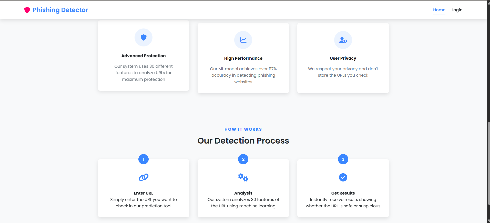
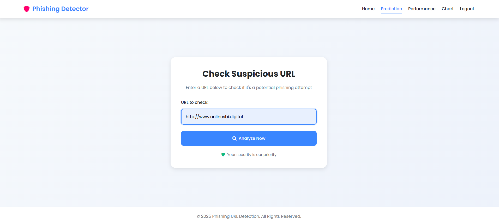
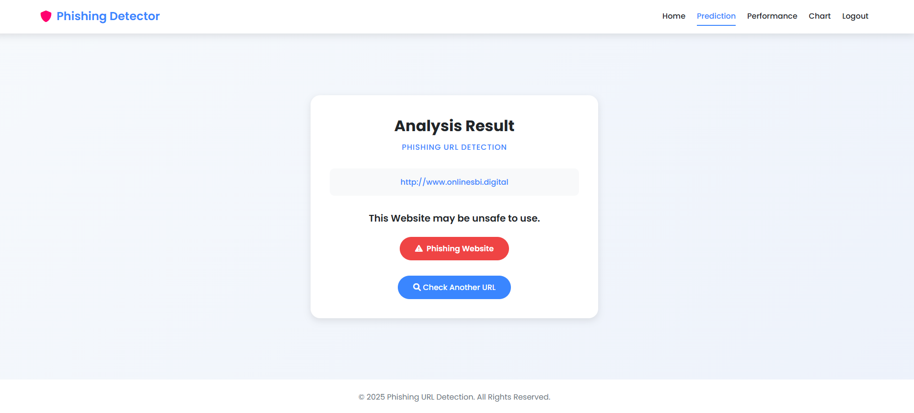
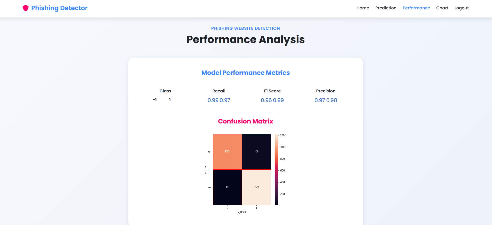
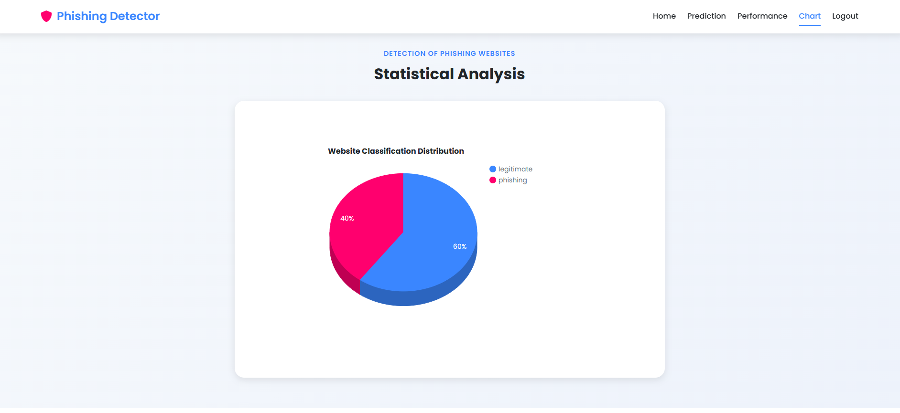

# Phishing URL Detection Website

A machine learning-based web application that detects whether a URL is legitimate or a phishing attempt.  
The system analyzes URL features and predicts the likelihood of the URL being malicious using a trained ML model.

## 🚀 Live Demo
Website Link: https://phishing-detection-f1wa.onrender.com

## 📸 Screenshots

### Homepage




### Prediction 



## Performance Analysis


## Analysis Chart



## ✨ Features

- Detects phishing URLs using a trained Machine Learning model
- Extracts important URL-based features for prediction
- Provides real-time prediction through a web interface
- Simple and user-friendly UI
- Fast classification of URLs

## 🛠 Tech Stack

Frontend
- HTML
- CSS

Backend
- Python
- Flask

Machine Learning
- Scikit-learn
- NumPy
- Pandas

## 📈 Model Performance

- Precision: **97%**
- High accuracy in detecting malicious URLs

## 📝 How It Works

1. User enters a URL in the web interface.
2. The system extracts important features from the URL.
3. The trained machine learning model analyzes these features.
4. The model predicts whether the URL is **Safe** or **Phishing**.
5. The result is displayed instantly on the webpage.

## ⚙️ Installation

Clone the repository
```bash
git clone https://github.com/yourusername/Phishing-URL-Detection-Website.git

Navigate to the folder

cd Phishing-URL-Detection-Website


Install dependencies

pip install -r requirements.txt

Run the application

python app.py

Open in browser

http://localhost:5000
